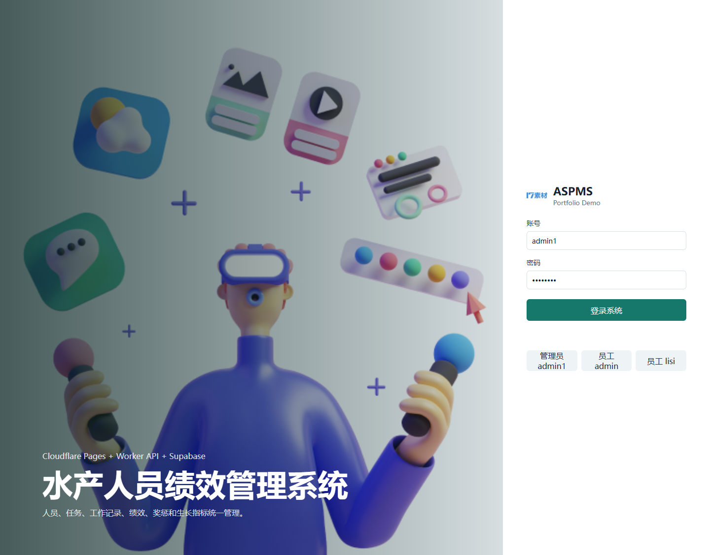
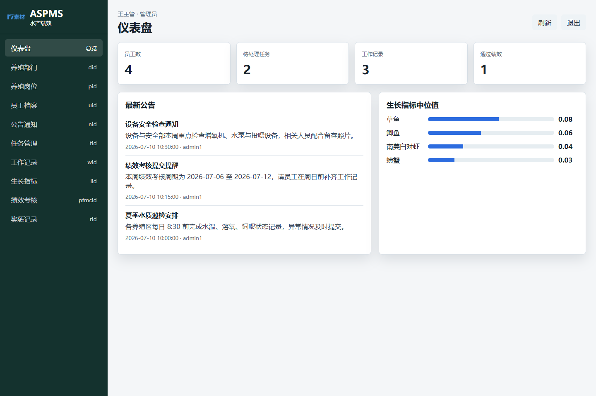

# 水产人员绩效管理系统

水产养殖场景下的人员、任务、工作记录、绩效、奖惩和生长指标管理系统，已改造为可在线演示的 Cloudflare Pages + Pages Functions + Supabase 版本。

[](https://ot-aquaculturestaffperformancems.pages.dev)


## 在线演示

- GitHub: https://github.com/Nemo-netone/ot-aquaculturestaffperformancems
- Demo: https://ot-aquaculturestaffperformancems.pages.dev
- 生产分支: `main`
- Cloudflare Pages 项目: `ot-aquaculturestaffperformancems`
- Worker API: `ot-aquaculturestaffperformancems-api`
- Supabase schema: `ot_aquaculturestaffperformancems`

## 演示账号

| 角色 | 账号 | 密码 |
|---|---|---|
| 管理员 | `admin1` | `admin123` |
| 普通员工 | `admin` | `admin` |
| 普通员工 | `lisi` | `lisi123` |

演示环境只放脱敏数据，不要录入真实手机号、证件号、生产经营数据或私人密码。

## 截图






## 功能

- 账号登录与演示账号切换。
- 仪表盘统计：员工数、待处理任务、工作记录、通过绩效、生长指标图表。
- 养殖部门管理：部门名称、职责说明、创建人。
- 岗位管理：岗位、所属部门、职责、要求。
- 员工档案管理：账号、身份、部门岗位、基础资料。
- 公告通知：发布养殖区通知、绩效提醒和安全检查安排。
- 任务管理：任务分配、状态跟踪、完成情况记录。
- 工作记录：日增重、物种、工作内容和照片文件名。
- 生长指标：不同物种目标日增重范围。
- 绩效考核：周期、结果、状态、申诉原因。
- 奖惩记录：奖励、提醒、扣罚原因。

更完整的功能树见 [docs/features.md](docs/features.md)，演示账号说明见 [docs/accounts.md](docs/accounts.md)。

## 架构

```text
浏览器
  -> Cloudflare Pages 静态前端: site/
  -> Pages Functions / Worker API: site/_worker.js
  -> Supabase REST RPC
  -> ot_aquaculturestaffperformancems 独立 schema
```

原始项目是 Spring Boot + JSP + MyBatis + MySQL 单体，源码保留在 `src/`、`data/`、`pom.xml` 中。线上演示环境不能直接运行 JSP/Tomcat，所以新增了 `site/` 和 `worker/`：

- `site/`: 面向在线演示的静态管理台。
- `site/_worker.js`: Pages 同域 API，处理 `/api/**.do`。
- `worker/`: 独立 Worker API 备用部署。
- `supabase/schema.sql`: Supabase 独立 schema、种子数据和项目专属 RPC。

## 本地运行

传统 Spring Boot 版本：

```powershell
mvn spring-boot:run
```

静态演示前端：

```powershell
python -m http.server 4173 -d site
```

Worker 本地调试需要环境变量或 Wrangler Secret：

```text
SUPABASE_URL=<supabase-project-url>
SUPABASE_SERVICE_ROLE_KEY=<supabase-service-role-key>
SUPABASE_SCHEMA=ot_aquaculturestaffperformancems
CORS_ALLOWED_ORIGINS=http://localhost:4173,http://127.0.0.1:4173
```

不要把真实密钥写入仓库文件。

## 部署

部署事实、分支、环境变量占位符和验证记录见 [docs/deployment.md](docs/deployment.md)。

核心命令：

```powershell
supabase db query --linked --file supabase/schema.sql
npx wrangler@3 pages deploy site --project-name ot-aquaculturestaffperformancems --branch main
```

## 许可证

本项目采用 PolyForm Noncommercial License 1.0.0。允许非商业学习、研究、修改和展示；商业使用需要作者另行授权。

## 已知限制

- 线上版本是 Cloudflare Worker API 兼容层，不是原 JSP 页面原样部署。
- 演示账号使用明文演示密码，适合作品集演示，不适合作为生产认证方案。
- 图片上传在演示版中保存文件名；生产环境应接入 Supabase Storage 或 Cloudflare R2。
